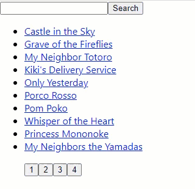

# Fetch and Render

> Version 1.0.0.1

A project that retrieves data from an API and renders a list of pages.

What is being **used** in this project:
- **React** to create the whole project

## What it does

1. Retrieves data from a given **API**. 
2. The returned data is **Rendered** in a list.

## Maintainers
Who worked on this:
- [Simon Capriles](https://simoncapriles.github.io/)

## Support

Found some issues?  
Write to this email: <a href="mailto:info@kyohei.com.bo"><i class="font-icon icon-envelope"></i>info@kyohei.com.bo</a>

## Github

Want to download or fork the project?  
Find it on Github: [submit-form](https://github.com/SimonCapriles/submit-form)